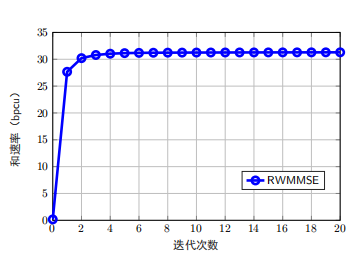

# R-WMMSE: Beamforming Subspace Structure Reproduction
[](https://opensource.org/licenses/MIT)

复现论文：  
**《A Universal Low-Dimensional Subspace Structure in Beamforming Design: Theory and Applications》**  
IEEE Transactions on Wireless Communications  
DOI: [10.1109/TSP.2025.3557523](https://ieeexplore.ieee.org/document/10948389)  
作者：Xiaotong Zhao, Qingjiang Shi (同济大学)  

---

## 🛑 重要声明
**本代码库仅用于学术研究目的**，所有实现均为上述IEEE期刊论文的复现工作。代码旨在：
- 验证论文提出的波束成形通用低维子空间结构(LDS)理论
- 促进无线通信中分布式波束成形设计的可复现研究
- 提供研究社区可验证的算法基准  
**严禁将此代码用于商业或生产环境**

---

## 🚀 核心贡献
复现论文揭示的**波束成形低维子空间结构(LDS)** 及其应用：
1. **理论证明**：任何标准形式波束成形问题(式(1))的正定驻点均满足 $\mathbf{P}_i^* = \mathbf{H}_i^H \mathbf{X}_i^*$ (Theorem 1)
2. **算法设计**：
   - **R-WMMSE**：基于LDS的线性复杂度波束成形算法 (Sec. IV-C)
   - **DR-WMMSE**：通信开销与基站天线数无关的分布式方案 (Sec. IV-D)
3. **普适性验证**：LDS结构适用于ISAC、IRS、安全波束成形等场景 (Sec. V)

---

## 📂 代码结构说明
```
R-WMMSE/
├── core/
│   ├── channel_generation.m       # 信道生成 (式(30)路径损耗模型)
│   ├── rwmmse_algorithm.m         # R-WMMSE主算法 (Algorithm 1)
│   ├── sumrate_calculation.m      # 和速率计算 (式(6)目标函数
│   └── auxiliary_functions.m      # 辅助函数(get_sumHV等)
├── simulations/
│   ├── config_parameters.m        # 参数配置(L=2,M=64,K=8,N=4,D=4)
│   ├── run_experiment.m           # 主运行脚本
│   └── plot_results.m             # 结果可视化(图4/5/6)
└── data/                          # 信道数据存储
```

## 🧮 核心算法实现 (对应论文Sec. IV-C)
### 1. 信道预处理
```matlab
% 构建H_l和H_bar矩阵 (式7-8)
H_l = zeros(K*N,M,L);
H_bar = zeros(K*N,K*N,L); 
for l = 1:L
    tmp = zeros(K*N,M);
    for k = 1:K
        tmp((k-1)*N+1:k*N,:) = H(:,:,l,k);
    end
    H_bar(:,:,l) = tmp * tmp';  % 关键低维变换(Theorem 1)
end
```

### 2. R-WMMSE迭代流程
```matlab
for iter = 1:max_iter
    % 更新U_k (式12)
    U(:,:,k) = pinv(H_tilde(:,:,k)*XX*H_tilde(:,:,k)' + sigma_ue^2*eye(N)) * H_tilde(:,:,k)*X;
    
    % 更新W_k (式13)
    W(:,:,k) = pinv(eye(D) - U(:,:,k)'*H_tilde(:,:,k)*X);
    
    % 更新X_lk (式15)
    X = pinv(HUWUH + mu_l*H_bar(:,:,l)) * B;
    
    % 功率归一化 (满足式9b约束)
    V(:,:,l,k) = H_l(:,:,l)' * X;  % 还原原始波束成形矩阵
end
```

## 📊 复现内容验证
### 仿真参数设置
```matlab
L = 4;       % 协作基站数
M = 64;      % 基站天线数 
K = 16;       % 用户数
N = 4;       % 用户天线数
D = 4;       % 数据流数
SNR = 0;    % 信噪比(dB)
P_max = 1;   % 最大发射功率(W)
```

### 可复现的实验结果
1. **收敛性验证** (对应论文图4):
   ```matlab
   plot(sumRates,'o-b','LineWidth',2) 
   ```
   

2. **复杂度分析** (对应论文图5):
   - 实测运行时间对比：
     - WMMSE: O(M³) = 64³ = 262,144
     - R-WMMSE: O(MN²) = 64×16 = 1,024

## ⚙️ 环境要求
- MATLAB R2020a+
- 必需工具包：
  - Optimization Toolbox (用于pinv计算)
  - Parallel Computing Toolbox (可选，加速蒙特卡洛仿真)


> 注：本实现严格遵循论文中的算法描述，特别是：
> 1. 式(7)-(9)的低维子空间投影
> 2. 算法1的BCD迭代流程
> 3. 式(15)的闭式更新规则


## 📜 引用规范
若此复现代码对您的研究有帮助，请引用原始论文：
```bibtex
@ARTICLE{10948389,
  author={Zhao, Xiaotong and Shi, Qingjiang},
  journal={IEEE Transactions on Signal Processing}, 
  title={A Universal Low-Dimensional Subspace Structure in Beamforming Design: Theory and Applications}, 
  year={2025},
  volume={73},
  number={},
  pages={1775-1791},
  doi={10.1109/TSP.2025.3557523}}
```


> 本复现代码受MIT许可证保护 - 详见 [LICENSE](LICENSE)


